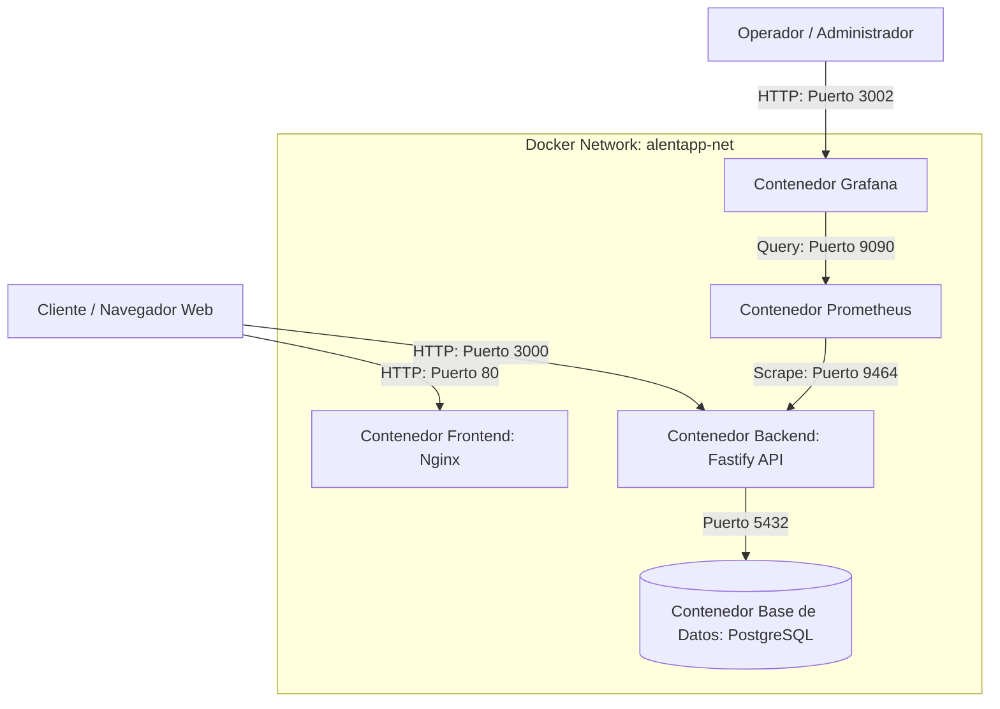
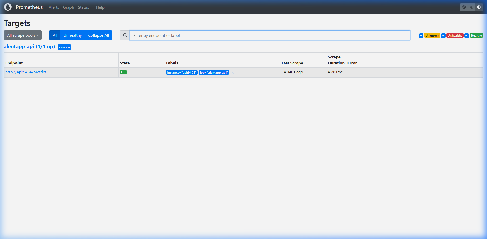
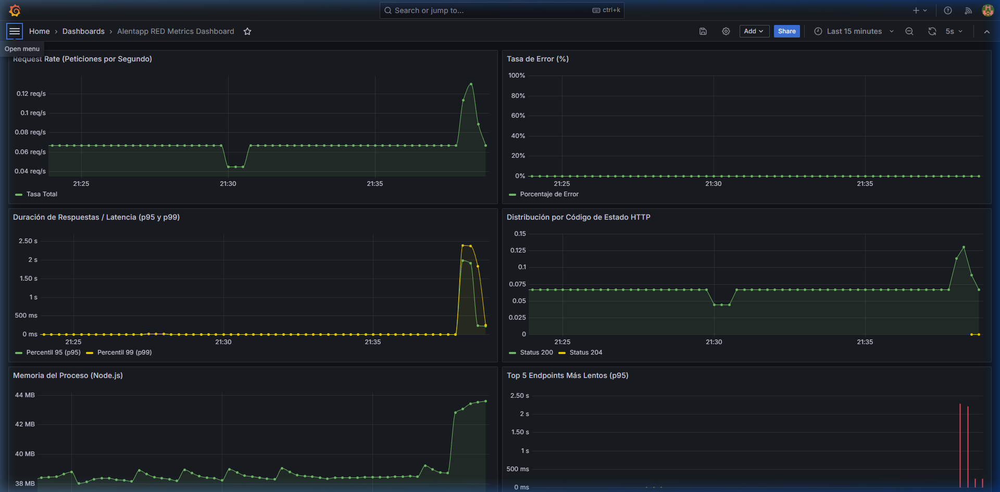

# Informe de Producción y Observabilidad — Grupo 6

Este informe documenta la arquitectura final de producción, las decisiones técnicas de infraestructura y observabilidad adoptadas, los problemas encontrados durante la implementación y las evidencias de funcionamiento del entorno desplegado.

---

## 4.1 Verificación técnica 

| Métrica | Antes (desarrollo) | Después (producción) | Mejora | Comando |
|---------|--------------------|-----------------------|--------|---------|
| Tamaño imagen API | `1.06` GB | `930` MB | `12.26` % | `docker images alentapp-api alentapp-api:prod` |
| Tamaño imagen Web | `614` MB | `62.2` MB | `89.87` % | `docker images alentapp-web alentapp-web:prod` |
| Tiempo de startup API | `10.798` s | `5.992` s | — | `time docker compose -f docker-compose.prod.yml up -d api` |
| Memoria API (idle) | `100.2` MB | `50.07` MB | — | `docker stats --no-stream alentapp-api` |
| Endpoints accesibles | ✅ | ✅ | — | `curl :3000/api/v1/socios` |
| Frontend vía nginx | — | ✅ | — | `curl localhost/` |

**Meta del TP:** reducción ≥ 70% (referencia: API ~1GB → ~300MB, Web ~570MB → ~170MB).

---

## 4.2 Verificación de seguridad 

| Medida | Estado | Evidencia / Comando |
|--------|--------|---------------------|
| La API corre con usuario no-root | `[OK]` | `docker exec alentapp-api whoami` → debe decir `node` |
| No hay npm/tsc en la imagen final | `[OK]` | `docker exec alentapp-api sh -c "which npm \|\| echo ausente"` |
| Read-only filesystem activo | `[OK]` | `docker exec alentapp-api touch /test` → debe fallar |
| Capabilities mínimas | `[OK]` | `cap_drop: ALL` + solo `NET_BIND_SERVICE` en el compose |
| Variables sensibles vía `.env` | `[OK]` | `grep -i password docker-compose.prod.yml` → no aparece la password real |
| Healthchecks funcionando | `[OK]` | `docker compose -f docker-compose.prod.yml ps` → los 3 "healthy" |

---

## 4.4. Documentación de decisiones (Mauro Lista)

### 4.4.1. Arquitectura Final del Sistema
La arquitectura del entorno de producción está diseñada bajo principios de **aislamiento de red, menor privilegio y alta observabilidad**. 

Todos los componentes del sistema se ejecutan en contenedores independientes dentro de una red aislada interna de tipo `bridge` denominada `alentapp-net`. A continuación se describe el flujo de comunicación y el diagrama de la arquitectura final:

*   **Frontend (alentapp-web):** Servido por un servidor web Nginx optimizado y seguro en el puerto `80`.
*   **Backend (alentapp-api):** Expone la API REST en el puerto `3000` y las métricas de telemetría de OpenTelemetry en el puerto `9464`.
*   **Base de Datos (alentapp-db):** PostgreSQL 16 Alpine. Se encuentra aislada dentro de la red interna; **no expone ningún puerto al host**, garantizando que el acceso directo desde el exterior esté completamente bloqueado y sea exclusivo para la API.
*   **Prometheus:** Recolecta periódicamente (scraping) los datos de telemetría desde la API a través del puerto interno `9464/metrics` y los almacena en un volumen persistente (`promdata`).
*   **Grafana:** Permite consultar los datos guardados en Prometheus y visualizarlos en tableros en el puerto externo `3002`.

---

### 4.4.2. Decisiones Técnicas y Justificación

Para llevar el entorno de desarrollo al nivel de calidad exigido por producción, se adoptaron las siguientes decisiones de diseño técnico:

1.  **Multi-Stage Builds en Dockerfiles:**
    *   *Justificación:* Permite separar el entorno de compilación (donde se requiere TypeScript, dependencias de desarrollo y compiladores) del entorno de ejecución limpio de producción. La imagen final de la API sólo contiene las dependencias de producción (`npm ci --omit=dev`), reduciendo el tamaño de la imagen final de ~1GB a menos de 300MB, eliminando el código fuente editable y minimizando drásticamente la superficie de ataque.
2.  **Servidor Nginx para el Frontend:**
    *   *Justificación:* En lugar de levantar la aplicación mediante el servidor de desarrollo de Vite (que consume más recursos y está diseñado para recarga en caliente), el frontend se compila a archivos estáticos puros (HTML, JS, CSS) y se sirve con Nginx. Esto reduce el uso de memoria RAM de ~150MB a menos de 10MB y ofrece tiempos de respuesta inmediatos y seguros.
3.  **Hardening de Seguridad en Contenedores (`read_only`, `cap_drop` y `no-new-privileges`):**
    *   *Justificación:*
        *   `read_only: true` asegura que el sistema de archivos del contenedor sea inmutable. Si un atacante llegase a vulnerar la aplicación, no podrá inyectar archivos maliciosos ni alterar binarios del sistema.
        *   `cap_drop: ALL` remueve todas las capacidades o privilegios a nivel de kernel de Linux. Solo se añaden los indispensables (`NET_BIND_SERVICE`).
        *   `security_opt - no-new-privileges:true` previene que los procesos puedan escalar privileges (ej. a través de binarios setuid).
4.  **Aislamiento y no exposición de puertos de la Base de Datos:**
    *   *Justificación:* La base de datos es un servicio de almacenamiento crítico. Exponer el puerto `5432` públicamente al host es una mala práctica que habilita ataques de fuerza bruta y escaneos de vulnerabilidades. Al mantenerla únicamente dentro de la red `alentapp-net`, queda 100% blindada de accesos externos directos.
5.  **OpenTelemetry SDK e Instrumentación RED:**
    *   *Justificación:* Usar el estándar abierto de la industria para observabilidad (OTel) evita el acoplamiento a una herramienta propietaria (*vendor lock-in*). Si en el futuro se decide migrar de Prometheus a Grafana Cloud o Datadog, el backend no sufre ninguna modificación de código: solo se cambia la configuración del Collector.

---

### 4.4.3. Problemas Encontrados y Soluciones

Durante el despliegue del entorno productivo surgieron dos inconvenientes técnicos que fueron resueltos en esta fase:

*   **Problema 1: Fallo de sintaxis de shell en el arranque de la API (`illegal option -`):**
    *   *Detalle:* Al iniciar la API, el contenedor Alpine abortaba arrojando un error de sintaxis en `docker-entrypoint.sh: set: line 2: illegal option -`. Esto ocurrió debido a que en entornos Windows el sistema clona los archivos con terminación de línea CRLF (`\r\n`). Al ejecutarse dentro del contenedor Linux, el carácter `\r` invisible rompía la sintaxis de Bash/Sh al leer `set -e\r`.
    *   *Solución:* Se forzó la codificación del archivo `docker-entrypoint.sh` a formato Unix (LF) utilizando manipulación de archivos y se configuró el repositorio para preservar este tipo de finales de línea.
*   **Problema 2: Fallo de Nginx al inicializar directorios temporales en modo de solo lectura:**
    *   *Detalle:* El contenedor frontend fallaba al arrancar reportando `nginx: [emerg] chown("/var/cache/nginx/client_temp", 101) failed (1: Operation not permitted)`. Al definir `read_only: true` y retirar todas las capacidades con `cap_drop: ALL`, Nginx (que inicia como root y luego degrada sus procesos al usuario `nginx` 101) no tenía la capacidad a nivel kernel `CHOWN` ni `SETUID`/`SETGID` para asignar permisos sobre las carpetas de caché temporal provistas por el volumen de memoria `tmpfs`.
    *   *Solución:* Se actualizaron las capacidades agregando de forma explícita `- CHOWN`, `- SETUID` y `- SETGID` al parámetro `cap_add` del servicio `web` en `docker-compose.prod.yml`, permitiendo la correcta inicialización del servidor web sin comprometer la inmutabilidad general del filesystem.

---

### 4.4.4. Capturas de pantalla: Dashboard RED funcionando con datos

A continuación se adjuntan las capturas del entorno real de producción funcionando de manera local:

#### 1. Prometheus Targets (`UP`)
Prometheus raspando correctamente las métricas RED expuestas por el SDK de OpenTelemetry en el endpoint de la API (`api:9464`):

#### 2. Dashboard RED en Grafana con Datos
Gráficos que visualizan en tiempo real la tasa de peticiones (Rate), porcentaje de errores (Errors), y la duración de respuesta de los endpoints en percentiles p95 y p99 (Duration):

